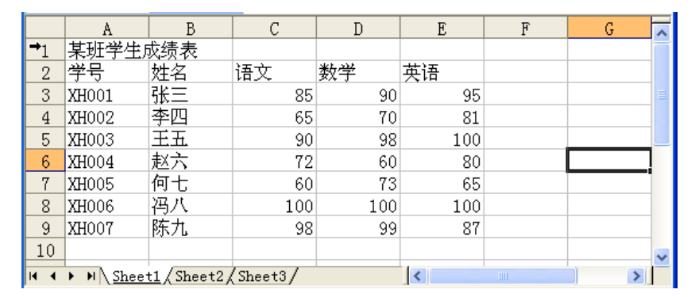
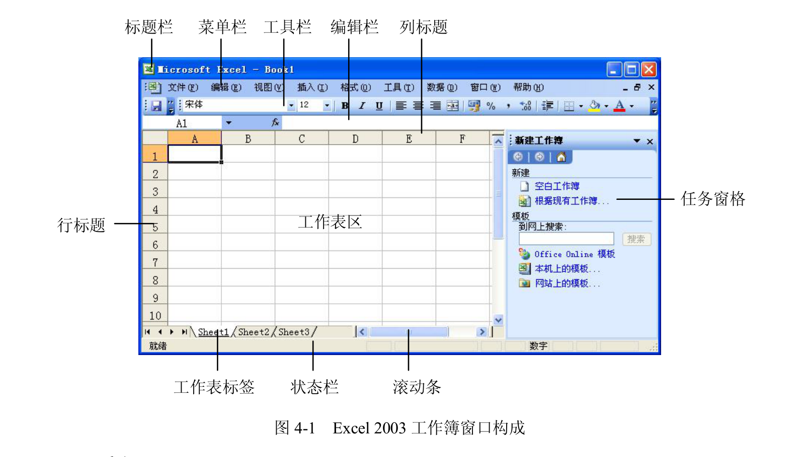
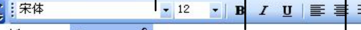

  

    
EXCEL 2003 · 第一课

    <h1 class="cover-title">把空白表 做成成绩表</h1>
    
先看清要做出什么，再想怎么做到。

    
高中信息技术 · 计算实验室

  

  

    <ExcelSheet mode="merged" />
  

<!--
教师提示：先让学生看见“终点”，不要先讲按钮。这里保留课件的任务驱动开场。
[Sources]
内容依据：/Users/wj/WorkBuddy/信息技术课/课程设计_Excel2003第一课.md
-->

---

先看终点

  

    <h1>成品长这样</h1>
    

      
今天的目标不是背按钮， <strong>是把这一张表做出来。</strong>

    

    
先看一眼终点，再回头找差距。

  

  

    
    
这就是我们要做出来的成绩表。

  

01 / 19

<!--
教师提示：让学生先描述看见的变化，不急着解释操作。
[Sources]
截图：教材《计算机应用基础教程》第 4 章中文 Excel 2003，课件裁剪图 demo_score_table_clean.png
-->

---

观察差距

<h1>它跟一张空白表差在哪？</h1>

  
1
标题只在 A1，成品让它<strong>横跨整行并居中</strong>。

  
2
表头是普通小字，成品让它<strong>加粗、居中、带下划线</strong>。

  
3
学号不用一个个敲，Excel 可以<strong>按规律续写</strong>。

  
4
平均分不是拿计算器按出来的，而是让 Excel <strong>自己算</strong>。

02 / 19

<!--
教师提示：四处差距就是学生接下来要解决的四个具体问题。
-->

---

今天的路线

<h1>今天只做三件事</h1>

  

<h2>标题跨列</h2>
选中一片格子，合并并居中。

  

<h2>字变好看</h2>
字体、字号、加粗、下划线。

  

<h2>学号续写</h2>
找到右下角的小黑十字。

每一关都先自己找；卡住了，再看线索和方法。

03 / 19

<!--
教师提示：把“自己找 → 给线索 → 给方法”作为课堂规则说清楚。
-->

---

先认眼前的窗口

  

    <h1>不必全背，先找到这四处</h1>
    

      
<h3>工作表区</h3>
中间这一大片格子，要填的东西都在这里。

      
<h3>名称框</h3>
告诉你现在点的是哪个格子，比如 A1。

      
<h3>格式工具栏</h3>
改字、合并，常用按钮都在上面。

      
<h3>编辑栏 × / √</h3>
改字时，× 是放弃，√ 是确定。

    

  

  

04 / 19

<!--
教师提示：完整窗口图只作为速查卡，不逐项讲解。让学生知道卡住时可以回来找。
[Sources]
截图：教材《计算机应用基础教程》第 4 章中文 Excel 2003，课件裁剪图 excel2003_window_cn2.png
-->

---

速查卡

<h1>窗口里每一块，做什么？</h1>

鼠标在按钮上停一秒，会弹出黄色提示。先做任务，找不到再回来。

05 / 19

<!--
教师提示：可以让学生自己指出工作表区、名称框和格式工具栏，确认他们知道去哪里找。
[Sources]
截图：教材《计算机应用基础教程》第 4 章中文 Excel 2003，课件裁剪图 excel2003_window_cn2.png
-->

---

layout: section
class: section-slide
---

  
第一关

  <h1>让标题跨列居中</h1>
  
先把一格里的标题，变成一整行的标题。

06 / 19

<!--
教师提示：这一页只宣布任务，不要立刻给方法。
-->

---

动手做

  

    <h1>标题缩在 A1， 怎么横跨 5 列还居中？</h1>
    

<strong>自己找：</strong>工具栏里有没有“合并及居中”？

    

      
1
先选中 <strong>A1:E1</strong> 这一片。

      
2
再点“合并及居中”。

      
3
标题会跨列，并自动跑到正中间。

    

  

  
<ExcelSheet mode="plain" />

07 / 19

<!--
教师提示：观察学生是否先选区域；只有卡住时再给线索和方法。
-->

---

别把两个动作混在一起

<h1>合并，不等于居中</h1>

  

    <h2>点“合并及居中”</h2>
    
格子合并好，文字<strong>自动居中</strong>。

    
平时做标题，最省事。

  

  

    <h2>格式 → 单元格 → 对齐</h2>
    
勾选“合并单元格”后，只是<strong>合成一个格子</strong>。

    
还要另把“水平对齐”设为“居中”。

  

注意：合并后只留下左上角那个格子的内容；做错了就撤销。

08 / 19

<!--
教师提示：这是本课最容易混淆的事实。可以先演示再让学生说出差别。
-->

---

layout: section
class: section-slide
---

  
第二关

  <h1>把字变好看</h1>
  
先选中对象，再改格式。顺序不要反。

09 / 19

<!--
教师提示：第二关是第一关的复习和迁移，不需要再次完整讲授。
-->

---

动手做

<h1>先选中，再改格式</h1>

  

    
1
标题选 <strong>A1:E1</strong>：黑体、20 号、加粗。

    
2
表头选整行：加粗、12 号、居中。

    
3
表头再加一条<strong>单下划线</strong>。

  

  

<strong>自己找：</strong>字体框、字号框、B、U、居中分别在哪？

10 / 19

<!--
教师提示：允许按钮、菜单和快捷键路径不同，只要最后的成品一致。
[Sources]
截图：教材《计算机应用基础教程》第 4 章中文 Excel 2003，课件裁剪图 toolbar_format_focus.png
-->

---

三条路，结果一样

<h1>改字在哪改？</h1>

  
<h2>格式工具栏</h2>
选中格子，直接点字体、字号、B、I、U。

  
<h2>菜单</h2>
格式 → 单元格 → 字体，一次设全。

  
<h2>快捷键</h2>
Ctrl+B 加粗　Ctrl+U 下划线

你找到的路径和别人不一样，也不代表做错；看最后的表格。

11 / 19

<!--
教师提示：强调“允许路径差异”，不要把按钮法讲成唯一正确答案。
-->

---

格式速查

  

    <h1>找不到按钮？ 放大看这里</h1>
    
鼠标停在按钮上，等一秒，Excel 会告诉你它叫什么。

    

先选格子，再点按钮。没有选中对象，按钮就不知道要改谁。

  

  

12 / 19

<!--
教师提示：这页作为巡堂时的投屏速查，不需要逐项念。
[Sources]
截图：教材《计算机应用基础教程》第 4 章中文 Excel 2003，课件裁剪图 toolbar_format_focus.png
-->

---

layout: section
class: section-slide
---

  
第三关

  <h1>让 Excel 替你抄</h1>
  
重复的事，先看看能不能交给电脑。

13 / 19

<!--
教师提示：这是“重复劳动 → 自动化”的种子。先让学生手填 1、2，再揭示填充柄。
-->

---

动手做

  

    <h1>学号 1、2、3…… 你要一行行打吗？</h1>
    
先在前两格写好 <strong>1、2</strong>。

    
选中它们，找右下角的小黑十字。

  

  
<ExcelSheet mode="fill" :show-fill-handle="true" />

<strong>给方法：</strong>抓住填充柄往下拖到 6，Excel 会续出 3、4、5、6。

14 / 19

<!--
教师提示：关注学生是否抓准右下角的小黑十字，抓错位置容易变成移动单元格。
-->

---

小黑十字

<h1>填充柄到底做了什么？</h1>

  

    
1
你给了 Excel 两个样本：<strong>1、2</strong>。

    
2
它看出规律：每次<strong>加 1</strong>。

    
3
拖到下面，它把规律续成 3、4、5、6。

  

  

今天学到的不只是一个小黑十字。

重复 → 找规律 → 交给电脑

15 / 19

<!--
教师提示：把自动填充和后续公式填充连接起来，但不要提前展开第二课内容。
-->

---

做对就行

<h1>按钮、菜单、快捷键，选哪条路都可以</h1>

  

    

      
✓
标题跨 5 列，文字在中间。

      
✓
表头清楚，和下面的数据分得开。

      
✓
学号按规律排好，不靠逐个输入。

    

  

  
<ExcelSheet mode="merged" />

16 / 19

<!--
教师提示：用成品验收，不纠正学生的非主路径。
-->

---

回头看

<h1>今天你把这件事做成了</h1>

  
<h2>先选中</h2>
要改哪一片，先让 Excel 知道对象是谁。

  
<h2>合并及居中</h2>
标题横跨多列，文字自动到中间。

  
<h2>格式工具栏</h2>
字体、字号、加粗、下划线，找不到就停一下看提示。

  
<h2>填充柄</h2>
拖一拖把规律续下去；重复的事先交给电脑。

下节课：同一个小黑十字，拖的不是数字，而是公式。

17 / 19

<!--
教师提示：收束到“公式 + 自动填充”的下节课连接。
-->

---

课后动手

<h1>做一张“我的课程表”</h1>

  
<h2>必做</h2>
标题跨列合并居中、黑体；用自动填充排好“第 1 节”到“第 8 节”或星期。

  
<h2>选做</h2>
给课程表加底纹或边框，让不同的内容更容易看清。

  
<h2>想一想</h2>
如果全班 50 个人都要填学号， 你还会一行行敲吗？

18 / 19

<!--
教师提示：作业保持三层，课堂口头说明即可；不要把分钟数带到学生课件里。
-->

---

layout: section
class: close-slide
---

  
Excel 2003 · 第一课

  <h1>先看目标， 再找方法。</h1>
  
下一次，让平均分自己算出来。

19 / 19

<!--
教师提示：结束时提醒学生保存自己的成绩表，下一课继续使用填充柄。
-->
